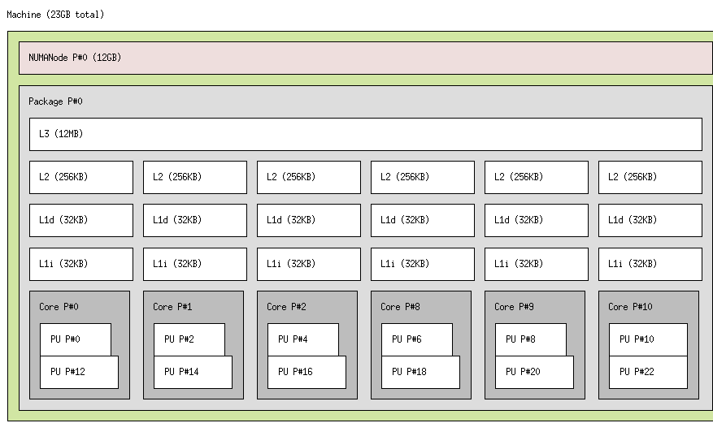

# Node architecture and memory
## 1.1 Node architecture and memory
* 1
	* sockets:		2
	* cores/socket:	6
	* treads:		2

* 2
	* machine:		23GB
	* NUMAnode:		12GB
* 3
	* DirectMap4k:      318592 kB
	* DirectMap2M:    15347712 kB
	* DirectMap1G:     9437184 kB
	
	
# Timing sequential and parallel executions
## 1.2 Serial compilation and execution
* 1
	make pi_seq
* 2
	`bash
	./run-seq.sh pi_seq 1000000000
	Number pi after 1000000000 iterations = 3.141592653589971
	7.869109
	7.86user 0.00system 0:07.87elapsed 99%CPU (0avgtext+0avgdata 1444maxresident)k
	0inputs+0outputs (0major+74minor)pagefaults 0swaps
	`
	* getusec_ is the function that returns the current time. The program returns the difference between the timestamp at the start of the execution and at the end of the execution. It uses the `stamp` variable to remember the timestamps and the struct `time` (of type timeval) to extract the current time using the `timeofday` function.

## 1.3.1 Compiling OpenMP programs
* 1
	* `bash
		pi_omp.c: In function 'main':
	pi_omp.c:60:0: warning: ignoring ##pragma omp parallel [-Wunknown-pragmas]
	     ##pragma omp parallel private(x) firstprivate(sumlocal)
	 ^
	pi_omp.c:62:0: warning: ignoring ##pragma omp for [-Wunknown-pragmas]
	         ##pragma omp for 
	 ^
	pi_omp.c:67:0: warning: ignoring ##pragma omp critical [-Wunknown-pragmas]
	         ##pragma omp critical 
	 ^
	`
	* Warning
	* Yes
* 2
`-fopenmp`
* 3

